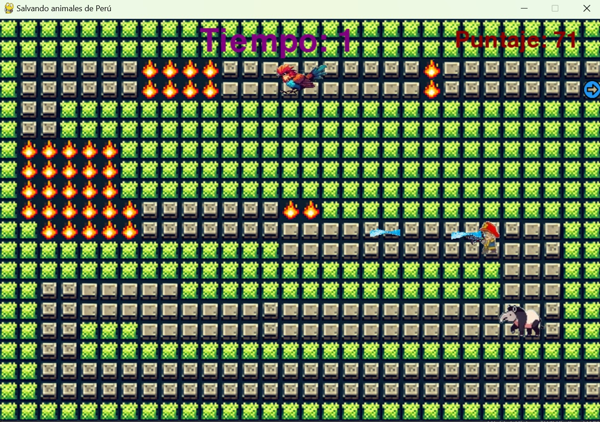
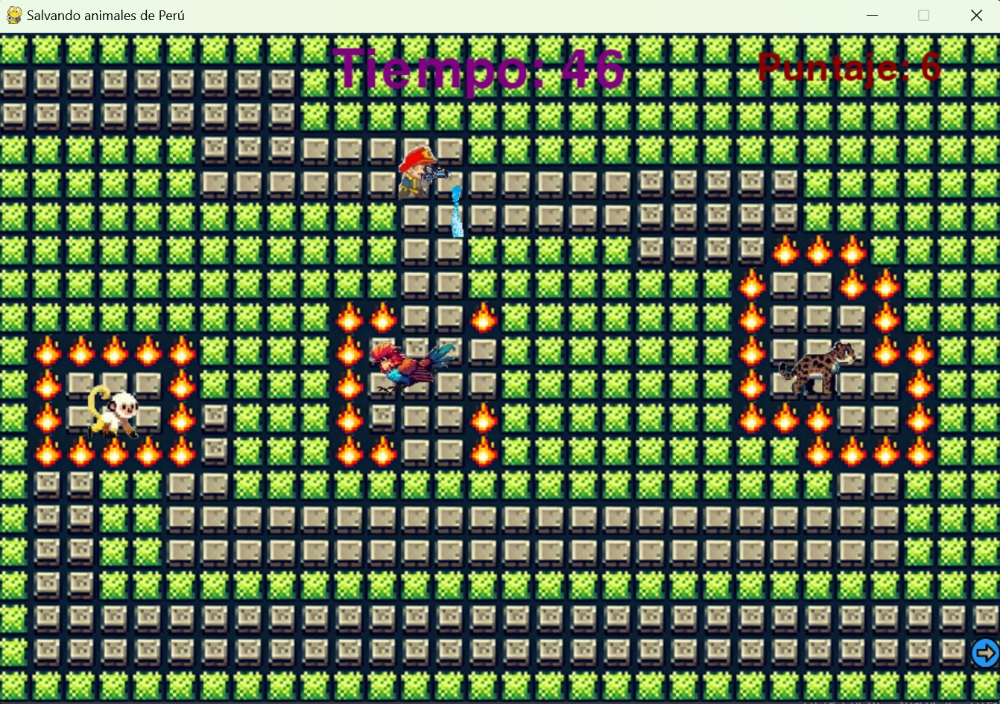
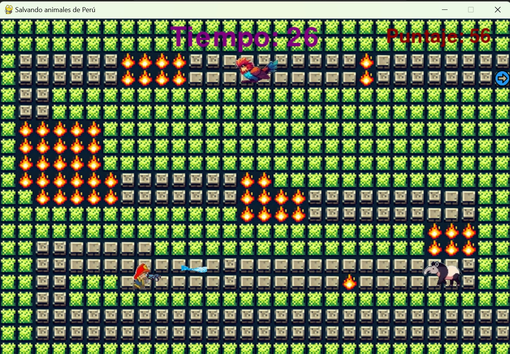

# Videojuego: Guardianes de la selva peruana
## Videojuego desarrollado por:  
- Canales Yarin Edward Alexander
- Vega Soldevilla Miguel Angel
- Acuña Napan Jaime Gonzalo

## Links:  
Jugable desde la plataforma  
- [https://sandercanalesyarin.itch.io/incendios-en-la-selva](https://sandercanalesyarin.itch.io/incendios-en-la-selva)

Descargable para jugadar desde Windows  
- [https://sandercanalesyarin.itch.io/apagando-incendios](https://sandercanalesyarin.itch.io/apagando-incendios)

PPT
- [https://www.canva.com/design/DAGYff8i7ZE/xsvYyu1mAeA4CuPmq3xvrQ/edit?utm_content=DAGYff8i7ZE&utm_campaign=designshare&utm_medium=link2&utm_source=sharebutton](https://www.canva.com/design/DAGYff8i7ZE/xsvYyu1mAeA4CuPmq3xvrQ/edit?utm_content=DAGYff8i7ZE&utm_campaign=designshare&utm_medium=link2&utm_source=sharebutton)
  
## ¿Cómo encontrarnos?
En el siguiente video se describe los pasos a seguir para encontrarnos [https://youtube.com/shorts/-w7c-BZNtxQ?si=R2cgY8KqBNUDsCB-](https://youtube.com/shorts/-w7c-BZNtxQ?si=R2cgY8KqBNUDsCB-)  

## Imágenes del videojuego

